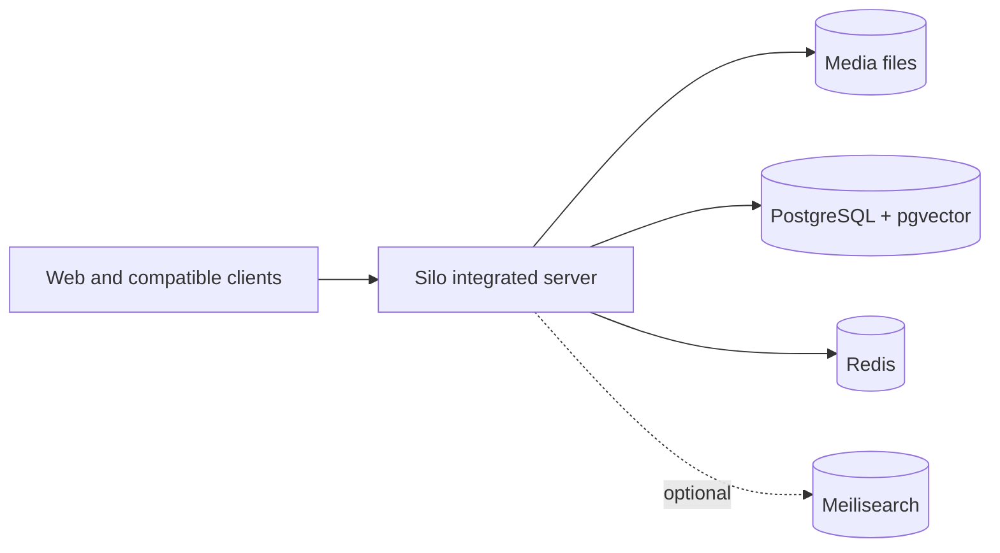

# Deploy Silo with Docker

Docker Compose is the recommended way to run Silo. The repository's default
stack is designed for a new single-host installation and includes:

- Silo in `integrated` mode
- PostgreSQL 18 with pgvector
- Redis
- FFmpeg and the Silo web application in the Silo image

Start with this layout unless you already operate the supporting services or
need dedicated delivery nodes.



## Requirements

- Docker Engine or Docker Desktop
- Docker Compose 2.24 or newer
- Git and OpenSSL for the quick-start commands
- An absolute host path containing your media

For hardware acceleration, the host must also have the appropriate GPU driver
and container runtime support.

## Initial configuration

Clone the repository and create `.env` from the maintained example:

```sh
git clone https://github.com/Silo-Server/silo-server.git
cd silo-server
cp .env.example .env
chmod 600 .env
printf '\nPOSTGRES_PASSWORD=%s\nSECRET_KEY=%s\n' \
  "$(openssl rand -hex 24)" "$(openssl rand -base64 48)" >> .env
```

Set the host path to your media:

```dotenv
MEDIA_ROOT=/path/to/your/media
```

Then start the stack:

```sh
docker compose up -d
```

Open <http://localhost:8090> and complete onboarding. The default Compose stack
wires the PostgreSQL and Redis connections; libraries, users, providers,
storage, search, and playback settings are managed through the admin interface.

> [!CAUTION]
> `SECRET_KEY` is the master key for encrypted server-owned credentials. Keep it
> secret and back it up separately from database dumps. Losing it makes stored
> integration and storage credentials unrecoverable.

The encryption design is documented in
[Secret encryption at rest](../../architecture/secret-encryption.md).

## Container image selection

The default `.env.example` follows `ghcr.io/silo-server/silo-server:latest`.
Before the first release, successful default-branch publications also receive
an ordered `build-N` tag and a short commit-SHA tag.

Use `SILO_IMAGE` to select an image:

```dotenv
SILO_IMAGE=ghcr.io/silo-server/silo-server:build-N
```

Use a commit-SHA tag or digest when a deployment or rollback target must be
immutable. See [Release versioning](../../release-versioning.md) for the full
tag contract.

## Storage and state

The deployment Compose files use host bind mounts rather than Docker-managed
volumes. `SILO_DATA_ROOT` defaults to `/opt/silo` and contains:

| Host path | Purpose |
| --- | --- |
| `/opt/silo/postgres` | Durable PostgreSQL data |
| `/opt/silo/redis` | Redis persistence |
| `/opt/silo/plugins` | Installed plugin cache |
| `/opt/silo/compat` | Compatibility assets |
| `/opt/silo/transcode` | Transient transcode output mounted at `/tmp/silo-transcode` |
| `/opt/silo/catalog-seeds` | Read-only catalog seed data |
| `/opt/silo/meilisearch` | Optional Meilisearch index |

Override the base path when required:

```dotenv
SILO_DATA_ROOT=/srv/silo
```

`MEDIA_ROOT` is mounted read-only at `MEDIA_CONTAINER_ROOT`, which defaults to
`/mnt/media`. Existing installations must preserve the in-container path stored
in their library records.

Durable application state lives in PostgreSQL. Redis holds coordination and
cache-style data. Transcode output is local and transient. If
`userdb.backend=sqlite` is selected, local user state is also written under
`/var/lib/silo/userdb` and must be included in the deployment's persistence and
backup design.

The default Compose file does not persist that SQLite path. Before enabling the
SQLite backend, add this volume to the `silo` service in a deployment override:

```yaml
services:
  silo:
    volumes:
      - ${SILO_DATA_ROOT:-/opt/silo}/userdb:/var/lib/silo/userdb
```

Validate the merged Compose configuration before recreating the container.

### Published ports

Change host-side port variables in `.env` when a default conflicts with another
service. The container listeners remain fixed.

| Variable | Default | Purpose |
| --- | ---: | --- |
| `PORT` | `8090` | Main web application and API |
| `JF_PORT` | `8096` | Jellyfin/Emby compatibility listener |
| `ABS_PORT` | `13378` | Audiobookshelf compatibility listener |
| `PROXY_PORT` | `8083` | Commented standalone proxy example |
| `TRANSCODE_PORT` | `8082` | Commented standalone transcode example |

> [!WARNING]
> The application and compatibility port mappings listen on all host interfaces
> by default and do not provide TLS themselves. Before allowing access beyond a
> trusted local network, use a correctly configured HTTPS reverse proxy and
> firewall, then set `SILO_PUBLIC_URL` and `SILO_TRUSTED_PROXIES` for that
> deployment. Do not expose PostgreSQL or Redis publicly.

## Hardware acceleration

The default stack is CPU-only so it can start on hosts without GPU devices.

### Intel or AMD VA-API and Intel Quick Sync

On a Linux host with `/dev/dri`, add the VA-API overlay:

```sh
docker compose \
  -f docker-compose.yml \
  -f docker-compose.vaapi.yml \
  up -d
```

To use the overlay for future Compose commands, set:

```dotenv
COMPOSE_FILE=docker-compose.yml:docker-compose.vaapi.yml
```

### NVIDIA NVENC

Install the NVIDIA driver and NVIDIA Container Toolkit first, then use the
NVIDIA overlay:

```sh
docker compose \
  -f docker-compose.yml \
  -f docker-compose.nvidia.yml \
  up -d
```

To make it the default for this installation:

```dotenv
COMPOSE_FILE=docker-compose.yml:docker-compose.nvidia.yml
NVIDIA_GPU_COUNT=1
```

Windows uses `;` instead of `:` between entries in `COMPOSE_FILE`.

## Optional Meilisearch

PostgreSQL full-text search works without an additional service. To make
Meilisearch available as an optional provider:

1. Generate a key and add it to `.env`:

   ```sh
   openssl rand -hex 32
   ```

   ```dotenv
   MEILI_MASTER_KEY=replace-with-generated-value
   ```

2. Start the `search` profile:

   ```sh
   docker compose --profile search up -d
   ```

3. In **Admin > Settings > Search**, select Meilisearch, set the URL to
   `http://meilisearch:7700`, enter the same key as the API key, test the
   connection, and save.
4. Restart Silo and rebuild the catalog search index from the same page.

Silo continues to use PostgreSQL full-text search until Meilisearch is selected.

## External PostgreSQL and Redis

> [!IMPORTANT]
> The default `docker-compose.yml` defines bundled PostgreSQL and Redis services,
> hard-codes the Silo service's internal connection URLs, and declares health
> dependencies on both services. Setting `DATABASE_URL` or `REDIS_URL` only in
> `.env` does not replace that wiring.

To use existing infrastructure, create a custom Compose definition or a tested
override that does all of the following:

- supplies the external `DATABASE_URL` and `REDIS_URL` to the Silo service
- removes or replaces the bundled-service dependencies
- omits the bundled PostgreSQL and Redis services from the deployed project
- preserves the media, plugin, compatibility, transcode, and catalog mounts
- preserves the same `SECRET_KEY` across every Silo role

Validate the merged configuration before starting it:

```sh
docker compose -f docker-compose.yml -f your-override.yml config --quiet
```

For a serious deployment, isolating PostgreSQL on a dedicated VM or managed
service can simplify database upgrades, tuning, and backups. Redis can remain
local for many installations or move to shared infrastructure when that is
already available.

## Server roles and distributed deployments

| Mode | Purpose |
| --- | --- |
| `integrated` | Recommended primary server with the API, frontend, scanners, workers, and configured local delivery. |
| `api` | Primary/control role for a custom distributed topology; configured local transcode fallback may still be used. |
| `proxy` | Dedicated stream and source-download delivery node. |
| `transcode` | Dedicated HLS and prepared-download worker. |

The main Compose file contains commented proxy and transcode examples. Most
single-host installations should leave them disabled because `integrated`
already includes proxying and transcoding.

For a distributed deployment:

- connect roles to the deployment's PostgreSQL and Redis infrastructure
- use the same `SECRET_KEY` on every role
- expose the same absolute source-media paths to processes that serve them
- persist the configured prepared-download artifact directory on every process
  that can prepare downloads
- restart a role after changing its artifact path

Prepared downloads can run on transcode nodes. A selected node keeps the result
on node-local storage and exposes it through Silo's authenticated internal
artifact API; the paired proxy relays the bytes, so the nodes do not require a
shared artifact mount. Dedicated transcode nodes default to a protected
directory inside the transcode volume selected at process startup.
`download.artifact_dir` overrides that location for dedicated transcode nodes
and the integrated/API-local fallback; mount the configured path anywhere that
can prepare downloads. Server-wide or per-user bandwidth-limited downloads
stay API-local so aggregate limits remain exact.

The client-facing delivery contract, including capability discovery and proxy
routes, is documented in the [Downloads API](../../downloads-api.md).

## PostgreSQL auto-tuning

The bundled deployment enables Silo's
[pgtune](https://github.com/le0pard/pgtune)-style OLTP tuning by default:

```yaml
POSTGRES_TUNE: auto
```

> [!CAUTION]
> With auto-tuning enabled, Silo uses `ALTER SYSTEM` and writes recommendations
> to PostgreSQL's `postgresql.auto.conf`. Set `POSTGRES_TUNE=off` before startup
> if PostgreSQL settings are managed elsewhere.

Reloadable settings are applied with `pg_reload_conf()`. Restart-only settings
are written and logged by name; apply them by restarting PostgreSQL once:

```sh
docker compose restart postgres
```

The bundled database user has the required permissions. For an external
database, keep `POSTGRES_TUNE=off` for the application credential and manage
tuning out of band with a separate administrative credential. Silo uses the
`DATABASE_URL` identity for both normal operation and tuning; it does not have
a separate tuning credential. Granting that identity `ALTER SYSTEM` permits
server-wide configuration changes if the application credential is
compromised.

Enable external tuning only in a trusted deployment that accepts this risk. Set
explicit `POSTGRES_TUNE_MEMORY` and `POSTGRES_TUNE_CPUS` values for the database
host and grant the `DATABASE_URL` user permission to run `ALTER SYSTEM`;
automatic host detection describes the Silo container, not a remote database
machine.

When `POSTGRES_TUNE_MEMORY=auto`, Silo uses the first trustworthy source from a
finite Docker cgroup limit, the bundled read-only `/host/proc/meminfo` mount,
or guarded `/proc/meminfo` detection. It reserves 25% of detected memory for
Silo, Redis, plugins, transcodes, the operating system, and other work by
default. Database-size classification uses
`pg_database_size(current_database())`.

| Variable | Default | Description |
| --- | ---: | --- |
| `POSTGRES_TUNE_PROFILE` | `oltp` | Tuning profile; only `oltp` is currently supported. |
| `POSTGRES_TUNE_MEMORY` | `auto` | Server or container RAM, such as `8GB` or `32GB`; explicit values are used as-is. |
| `POSTGRES_TUNE_MEMORY_BUDGET_PERCENT` | `75` | Percentage of auto-detected RAM used for PostgreSQL recommendations. |
| `POSTGRES_TUNE_CPUS` | `auto` | CPU count used for worker recommendations. |
| `POSTGRES_TUNE_STORAGE` | `ssd` | One of `hdd`, `ssd`, `san`, or `nvme`. |
| `POSTGRES_TUNE_DB_SIZE` | `auto` | Automatic classification, or `less_ram`, `mid_ram`, or `greater_ram`. |
| `POSTGRES_TUNE_CONNECTIONS` | `100` | PostgreSQL `max_connections`; raised when the Silo application pool is larger. |
| `POSTGRES_SHM_SIZE` | `8gb` | Docker `/dev/shm` size for bundled PostgreSQL. |

Turning auto-tuning off does not remove settings already written to
`postgresql.auto.conf`. Reset those PostgreSQL parameters if the deployment
later moves fully to a custom configuration.

## Backups and updates

Before an update:

1. Pin or record the current image reference for rollback.
2. Back up PostgreSQL and verify the backup can be read.
3. Back up `.env`, especially `SECRET_KEY`, separately from the database.
4. Preserve the effective Compose configuration and any custom overrides in a
   restricted backup location.
5. Review the incoming build or release for migration and compatibility notes.

After selecting the intended `SILO_IMAGE`, update only the application service:

```sh
docker compose pull silo
docker compose up -d --no-deps silo
```

Silo applies pending database migrations during startup. Allow startup to
finish before evaluating readiness or attempting another update.

Use a build tag, commit-SHA tag, or digest when reproducible rollback matters.
Do not assume that `latest` will continue to identify the image currently
running on the host.

> [!WARNING]
> Rolling back the Silo image does not reverse database migrations. Keep the
> pre-update database backup and effective Compose configuration paired with the
> previous image. Review every applied migration before deciding whether a
> binary rollback is sufficient or a coordinated database restore is required;
> restoring a database also discards writes made after the backup.

`docker compose config` can contain resolved database credentials and
`SECRET_KEY`. Treat its output as a secret-bearing backup: restrict its file
permissions, never paste it into issues or logs, and redact it before sharing.

After an update, verify both endpoints on the configured host-side `PORT`.
Replace `8090` below when `PORT` differs from the default:

```sh
curl -fsS http://localhost:8090/api/v1/health
curl -fsS http://localhost:8090/api/v1/ready
```

`health` reports process liveness. `ready` also checks required dependencies,
including PostgreSQL and configured S3 storage.

## Migrating from Continuum

Use the conservative preflight and cutover workflow in
[Continuum to Silo Docker Migration](../../continuum-to-silo-docker-migration.md).
Preserve the previous in-container media path when existing library records
store that path, and do not remove the migration backup until scanning,
metadata, users, plugins, and playback have been verified.

## Source References

- [`docker-compose.yml`](../../../docker-compose.yml)
- [`docker-compose.vaapi.yml`](../../../docker-compose.vaapi.yml)
- [`docker-compose.nvidia.yml`](../../../docker-compose.nvidia.yml)
- [`.env.example`](../../../.env.example)
- [Release versioning](../../release-versioning.md)
- [Downloads API](../../downloads-api.md)
- [S3 storage setup](../../s3-storage-setup.md)
